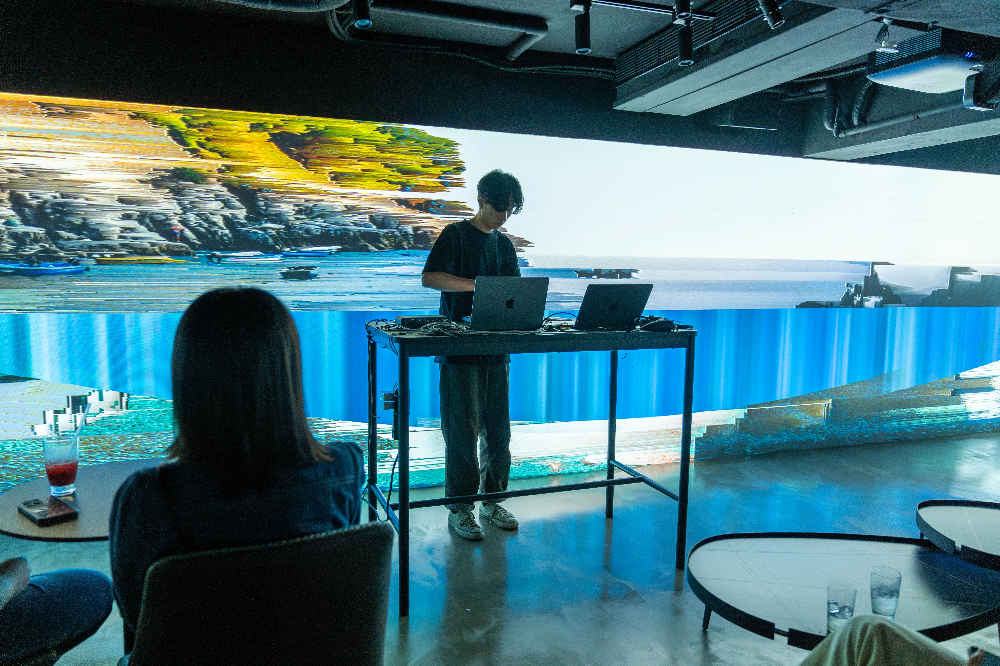
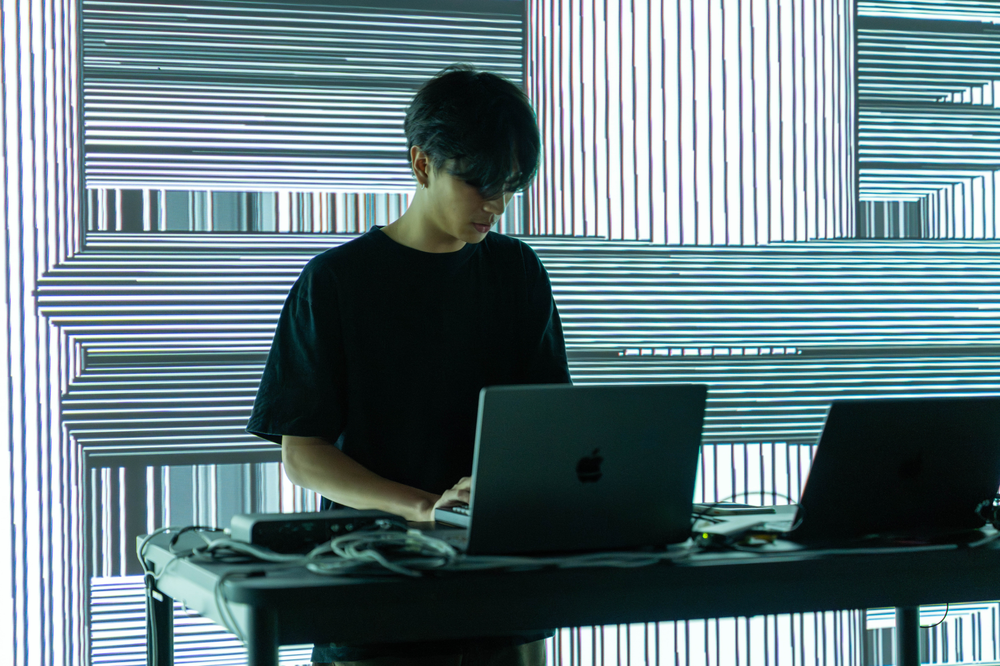

  

      

        This work intends to deal with the long and narrow space of the basement, using its architectural structure as the axis of visual and sound development, extending, stacking, and misaligning from different viewpoints, deconstructing the beams, columns, water pipes, and lines that support the operation of the base, like the internal organs of the building. In some parts it interspersed with the imagination of the infinite deep sea outside the submarine. 
The physical feeling of wandering in the ambiguous junction zone alternately changes between virtual and real, sometimes creating a closed feeling of suffocation and sometimes extending to the depths. Enter the immersive field that is separated from the real world, and cut off from the realistic space full of symbols. Calculation flows and flashes of points, lines, and surfaces combined with complex electronic breakbeats are intertwined to stimulate resonance among different senses. 
      

  

  

      

        此作品欲處理地下室的狹長空間，以其建築結構作為視覺及聲音發展的軸線，從不同視點往內部延伸、堆疊、錯位，解構支撐基地運作的樑柱、水管、線路等像是建築體的內臟器官，並不時穿插潛艇外無限深海的想像，虛實之間交錯變化出遊走在曖昧交界地帶的身體感，時而製造密閉的窒息感時而往深處擴延。進入抽離現實世界的沈浸式場域，與充滿符號的寫實空間切割。點、線、面的演算流動和閃現搭配複雜的電子碎拍相互牽連刺激不同感官間共振。 
      

  

  

      
      
(photo by : 林彥翔, 謝佳瑜)

  

  

      
      
(photo by : 林彥翔, 謝佳瑜)

  

  

      
      
(photo by : 林彥翔, 謝佳瑜)

  

  

      
      
(photo by : 林彥翔, 謝佳瑜)

  

  

      
      
(photo by : 林彥翔, 謝佳瑜)

  

  

      
      
(photo by : 林彥翔, 謝佳瑜)

  

  

      
      
(photo by : phont)

  

  

      
      
(photo by : phont)

  

  

      
      
(photo by : phont)

  

  

      
      
(photo by : phont)

  

  

      
      
(photo by : phont)

  

  

      
      
(photo by : phont)

  

  

  <iframe title="vimeo-player" src="https://player.vimeo.com/video/897389961?h=2f14f109a7" frameborder="0" allowfullscreen></iframe>

  

