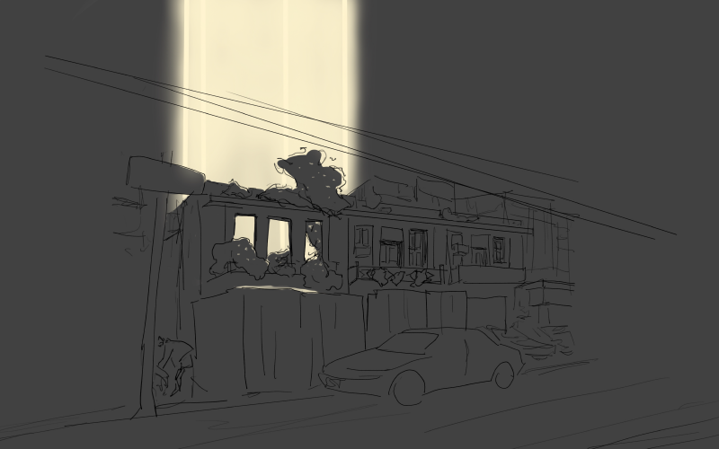
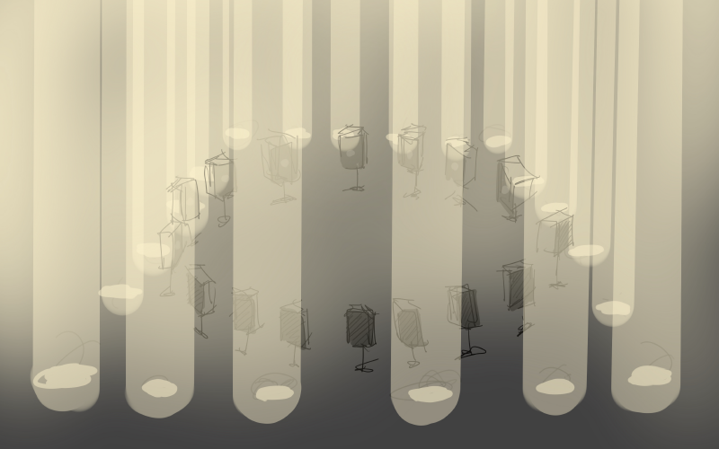

    

這棟建築與雙聯市場之間的關聯除了年代之外，在於面對絕對權力(時代、都市、疫情)之下的生存姿態。我以市場的聲音作為能量的累積，並在這棟沒有屋頂的廢棄建築中釋放，以光作為能量同時也視作建築體的延伸，將其想像成一種示威。 
    

    

    

    

<iframe title="vimeo-player" src="https://player.vimeo.com/video/643615957?h=2b5736f91e" frameborder="0" allowfullscreen></iframe>

