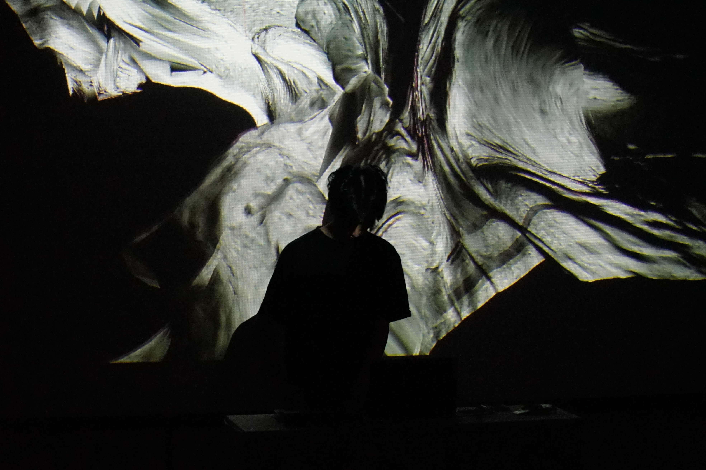
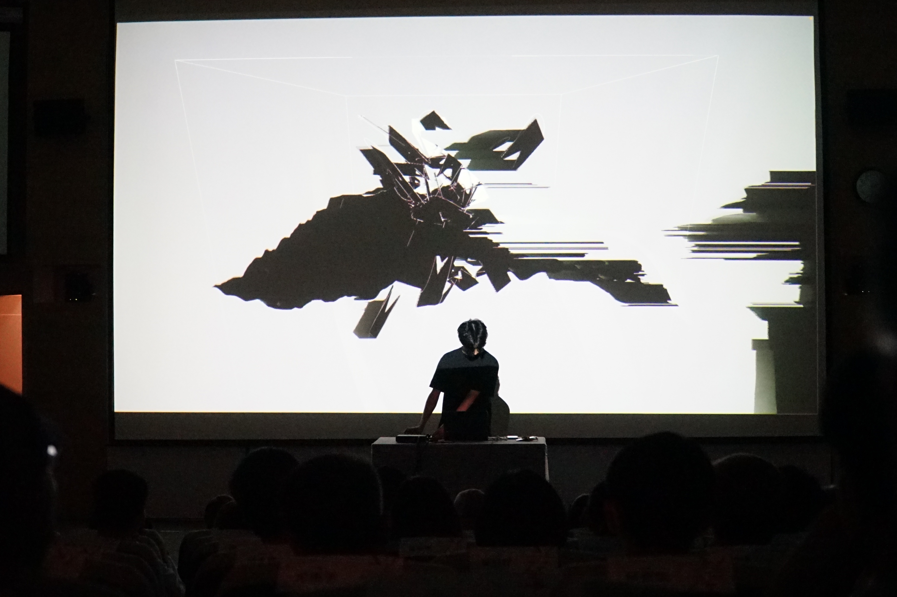
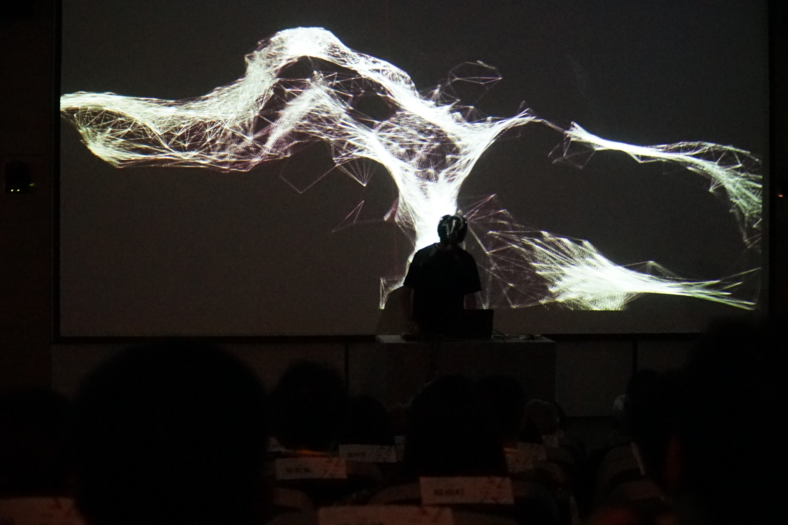

  

      

        This is a monster born in the desolate planet. We cannot see its body clearly, but we can feel its energy and hear the sounds made by different parts of its body
         
      

  

  

      

         
      

  

  

      
      
(photo credit : 國立台灣美術館)

  

  

      
      
(photo credit : 國立台灣美術館)

  

  

      
      
(photo credit : 國立台灣美術館)

  

  

      
      
(photo credit : 國立台灣美術館)

  

  

  <iframe title="vimeo-player" src="https://player.vimeo.com/video/1004237795" frameborder="0" allowfullscreen></iframe>

  

