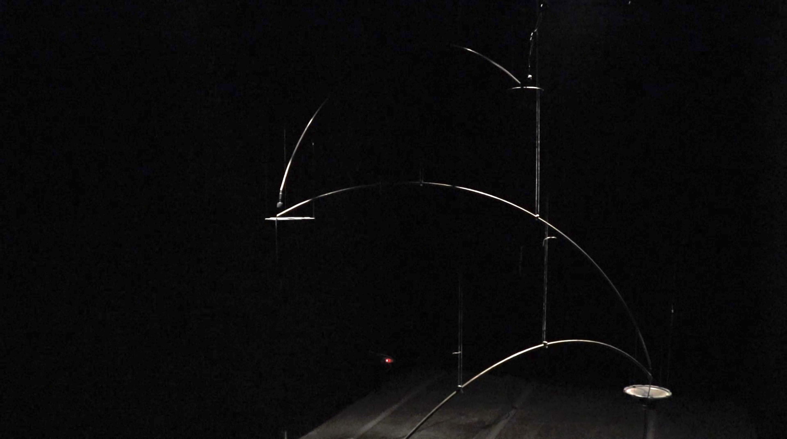
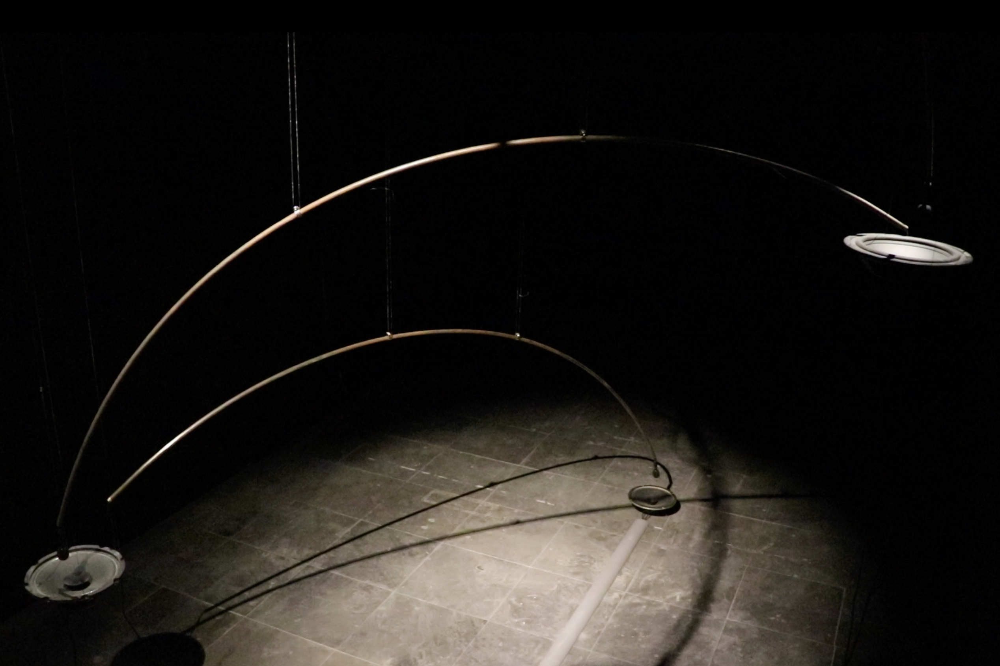

  

      

      Cross is a sound installation. I try to create a generative system of sound, and use sculptures to imply the relationship of transmission. I placed four sets of microphones and speakers in the space, microphone A receives the sound played by speaker A and transmits the sound to speaker B, microphone B receives the sound from speaker B and then transmits it to speaker C, and so on. Finally, the sound that is received by microphone D will be sent back to Speaker A, thereby generating a continuously deformed feedback sound. 
      This work is inspired by the observation of gossip between people. Speakers and microphones acting like mouths and ears, and the sound corresponds to the deformations of messages transmitted by word of mouth. When people enter the space, they hear barely nothing at the beginning, because there is no sound source. After a few seconds, the sound will appear through the complex feedback system. Except the system, people may realise that their action and position could also affect the sound. 
      

  

  

      
  

  

      

      Cross是一件聲音裝置作品，延續我之前的創作同樣以錯誤的聲音實驗出發，這次想推進我去年在作品Feeding中實驗的聲響，創造另一種較複雜的聲音回授的系統，並且試圖利用雕塑在作品中製造出一種輕盈、飛越、跳耀的狀態以暗示收音與放音之間的關係與聲音在空間中傳遞的狀態。 
    	此次聲音運作的方式為空間中靜態安放著四組麥克風與喇叭（在此以ABCD稱呼）A麥克風接收到A喇叭播放的聲音後將聲音傳送到B喇叭，B麥克風接收到B喇叭的聲音後傳送到C喇叭，以此類推，最後D麥克風接收到的聲音會再送回A喇叭，藉此形成經過四次變形的feedback（聲音在每個不同的單體喇叭中音量頻率等都會有些微的差異）因為變形、空間（空間影響聲音的反射）與觀者介入的差異而形成不可預期的聲響。作品靈感來自生活中對於人與人之間八卦的觀察，喇叭、麥克風作為口、耳，而聲音則呼應口耳相傳之下訊息產生的各種變形。 
      

  

  

      
  

  

  <iframe title="vimeo-player" src="https://player.vimeo.com/video/530008996" frameborder="0" allowfullscreen></iframe>
  
  

     
  

  

     
  

  

      
  

  

      
  

  

      
  

  

      
  

  <iframe title="vimeo-player" src="https://player.vimeo.com/video/548477446" frameborder="0" allowfullscreen></iframe>
