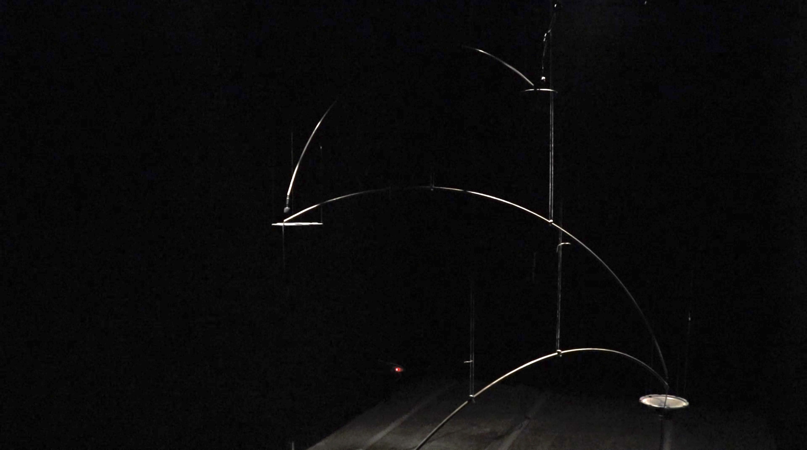
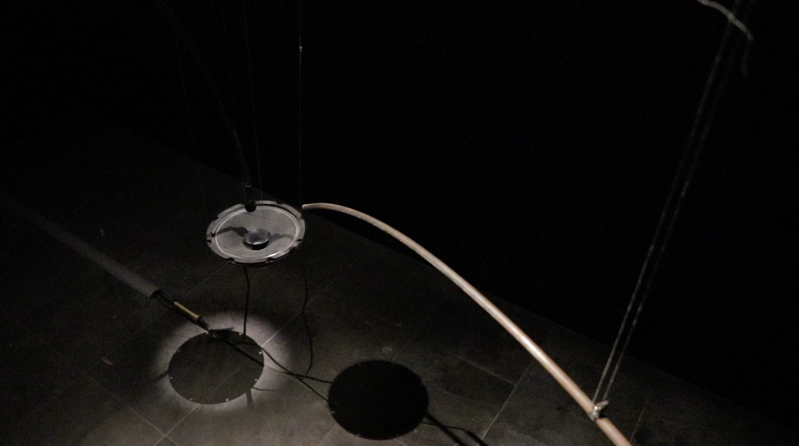
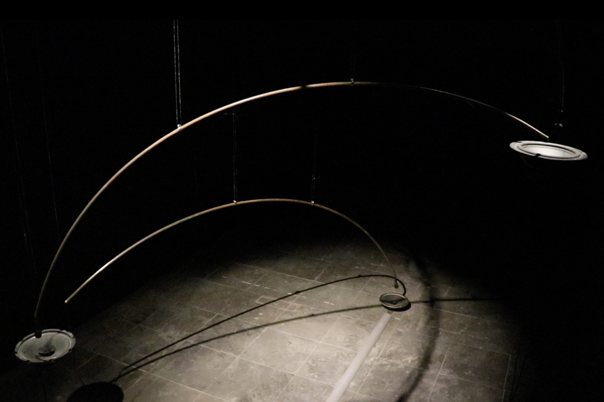

  
  

    

        Cross (v2)
    

    

        Sound installation 
        2021
    

  

  

      

      "Cross" is a sound installation work. I continue my previous creation and start from the wrong sound experiment. This time I want to advance the sound I experimented with the work "Feeding" last year, create another more complex sound feedback system, and try to use sculptures to create a state of flying and jumping to imply the relationship between receiving, amplifying and the state of sound transmission in space. 
      The way the sound works this time is that there are four sets of microphones and speakers (here called ABCD) statically placed in the space. A microphone receives the sound amplified by the A speaker and transmits the sound to the B speaker. After the B microphone receives the sound amplified by the B speaker It will be transmitted to the C speaker, and so on. Finally, the sound received by the D microphone will be sent back to the A speaker, thereby forming a feedback that has undergone four deformations (the volume and frequency of the sound will be different in each different single speaker. ) .Unpredictable sound is formed due to the deformation of feedback, space (space affects the reflection of sound) and the intervention of the viewer. 
      

  

  

      
  

  

      

      Cross是一件聲音裝置作品，延續我之前的創作同樣以錯誤的聲音實驗出發，這次想推進我去年在作品Feeding中實驗的聲響，創造另一種較複雜的聲音回授的系統，並且試圖利用雕塑在作品中製造出一種輕盈、飛越、跳耀的狀態以暗示收音與放音之間的關係與聲音在空間中傳遞的狀態。 
    	此次聲音運作的方式為空間中靜態安放著四組麥克風與喇叭（在此以ABCD稱呼）A麥克風接收到A喇叭播放的聲音後將聲音傳送到B喇叭，B麥克風接收到B喇叭的聲音後傳送到C喇叭，以此類推，最後D麥克風接收到的聲音會再送回A喇叭，藉此形成經過四次變形的feedback（聲音在每個不同的單體喇叭中音量頻率等都會有些微的差異）因為變形、空間（空間影響聲音的反射）與觀者介入的差異而形成不可預期的聲響。
      

  

  

      
  

  

      
  

  

  <iframe title="vimeo-player" src="https://player.vimeo.com/video/548477446" frameborder="0" allowfullscreen></iframe>
