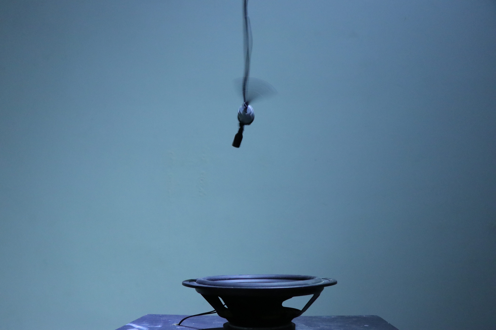
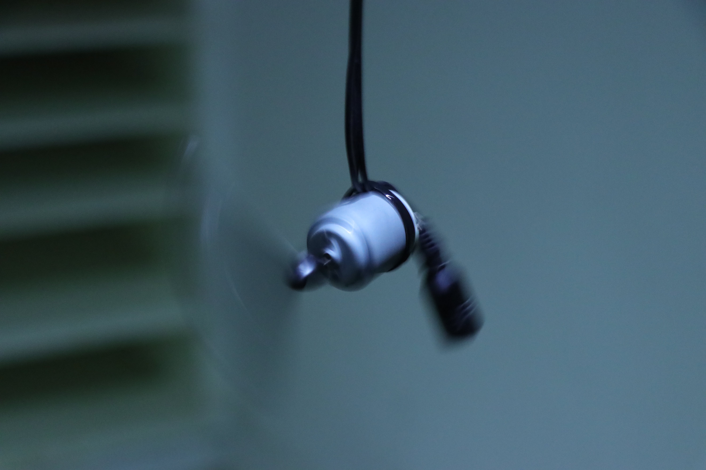
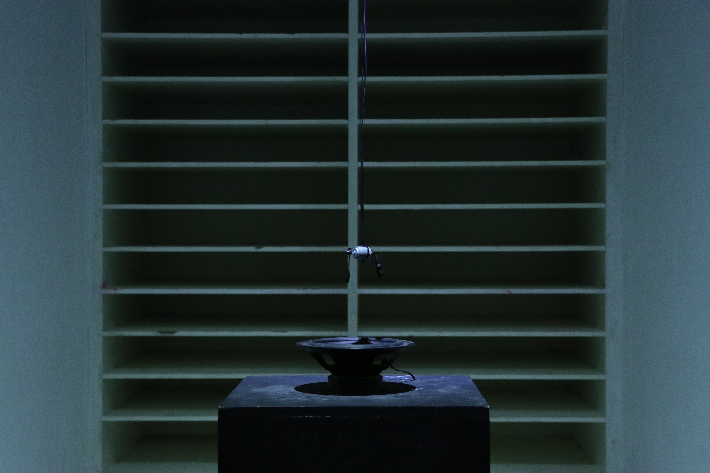

  
  

    

        Cyberfly
    

    

        Sound installation 
        2020
    

  

  

      

      

  

  

      
  

  

      

      Cyberfly是一件聲音裝置作品。我懸吊了一隻被束縛住的(利用馬達所模擬的)假蟲，在其尾端綁上一個麥克風，底下則放置一個喇叭。這隻蟲不斷地掙扎想逃離下方的威脅，同時促使他尾端的麥克風跟喇叭的距離和角度不斷變化，在這個過程中原本應該無限放大的回授聲響因為角度與距離的改變變成了不固定出現的特殊聲響。 
      此作品作為一聲響的實驗，承襲我之前的作品「Feeding」同樣也是在處理「聲音回授(feedback)」這一個現象，不同於上次這次比較著重的是低頻率的回授，透過聲音連結到工作室周圍惱人的蟲鳴的聽覺經驗並提取了回授現象本身的危險這項元素而做了這樣的作品，希望透過這層層的關係使觀者對於聲響有更多想像。 
      

  

  

      
  

  

  <iframe title="vimeo-player" src="https://player.vimeo.com/video/457294371" frameborder="0" allowfullscreen></iframe>
