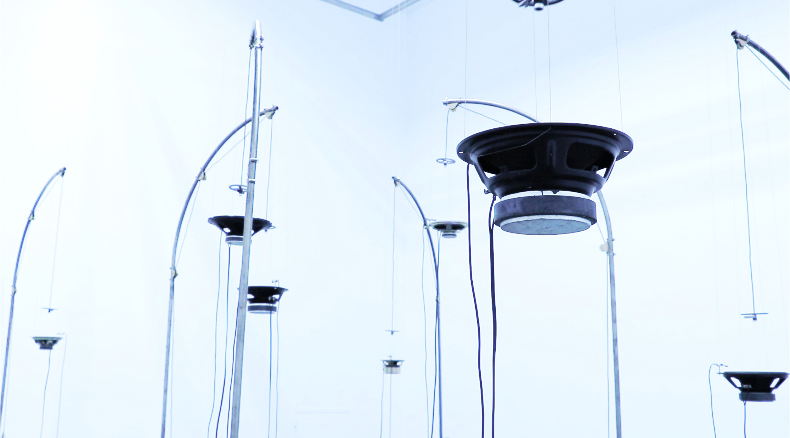

  

    Sound often breaks the limitations of space and creates sense of space at the same time. Some sounds are easy to reflect and reverberate in the space, some are very penetrating, some remain and some are absorbed... During the operation of the work, the microphone receives the vibrations in the air, and continuously amplifies through the feedback system. Through the different heights of multiple units and the rules build by mechanical motors, sensors, and sounds, different pure sound waves are entangled with each other to form a complex system in an environment where there is no any sound source. 
In addition, Human intervention will change the structure of acoustics space and disturb the sound generative system. In this work, sound does not serve as a carrier of narrative, nor does it aim at reproduction, nor does it exist to serve other media. Instead, it presents the sound itself, the composition of the sound, and the relationship between the sound, space and body. People could feel the violence, overlap, penetration, aggression and beauty of sounds from different angles. 
  

    
    
(photo credit : CHANG HSIN YU)

  

Feeding is a sound installation work. There are multiple units in the space (depending on the size of the space). Each unit consists of a metal sculpture in the shape of a fishing rod, a condenser microphone, a speaker and a volume sensor. When the volume is too low, the cable on the fishing rod will relax, causing the microphone to drop closer to the speaker. When the volume is too high, it will rise away from the speaker, creating a state of finding balance. During operation, each speaker will have more prominent sound performance in different frequency, and sound feedback will amplify this characteristic, so that each speaker will have sounds of different pitches, and different units will also affect each other and create accidental vibration. 
Audio feedback is a phenomenon that easily occurs when we use a microphone and we hope to avoid it. The sound signal received by the microphone is amplified and sent out of the speaker, and the sound from the speaker is again received by the microphone and further amplified. Sound feedback is an erroneous sound. In this work, I imagine it to be an out-of-control sound beast. I try to tame this erroneous sound through mechanical devices, using the shape and dynamics of the fishing rod to metaphorize this relationship. 
  

    

    聲音常常是突破空間限制卻同時建構了空間感,有的聲音容易在空間中反射迴盪,有的則極具穿透性,有的殘留有的則被吸收......。作品運作過程中麥克風不斷接收著空氣中細微的震動,藉由與喇叭產生的反饋不斷放大,透過多個單元高低錯落及機械式馬達、感測器、聲音三者之間建構出的規則,使得不同的純粹的聲波在原本沒有音源的環境中相互纏繞形成複雜的系統。而人的介入將改變空間聲學的結構,也擾動著此一聲音的衍生系統。在這件作品中聲音不作為敘事的載體,也不以再現為目標,更不為了服務其他媒介而存在,而是呈現聲音自身,聲音的構成,聲音與空間與身體之間的關係,以不同的角度感受聲響的暴力、堆疊、穿透、侵略與優美。 
    Feeding是一件聲音裝置作品，空間中有多個單元(是空間大小而定)，每個單元皆由一個釣竿形象的金屬雕塑、一個電容式麥克風、一顆單體喇叭及一個音量感測器組成，當音量太小時釣竿上的線會放鬆使得麥克風下降接近喇叭，聲音太大會上升遠離喇叭形成一個在尋找平衡的狀態。運作過程中，因每顆喇叭會在不同頻段的聲音有較突出的表現，聲音回授將這個特性放大，使每顆喇叭有不同音高的聲響，不同單元之間也會互相影響而偶然的出現合聲，形成特殊的聽覺體驗。 
    聲音回授(audio feedback)是當我們在使用麥克風時容易發生並希望能夠避免的現象，麥克風接收的聲音訊號被放大並傳出音響，而音響傳出的聲音又再次由麥克風接收，進一步放大，然後通過音響再次傳遞出來。聲音回授作為一種錯誤的聲響，在這件作品中我將他想像成是一種失控的聲音猛獸，我試圖透過機械裝置的形式來馴服這種錯誤的聲音，利用釣竿的造型及動態暗示了這種關係。 
    

    
    
(photo credit : CHANG HSIN YU)

    
    
(photo credit : CHANG HSIN YU)

<iframe title="vimeo-player" src="https://player.vimeo.com/video/454239749" frameborder="0" allowfullscreen></iframe>

   

   

    
    
(photo credit : CHANG HSIN YU)

    
    
(photo credit : CHANG HSIN YU)

<!-- 

 -->

<!-- <iframe title="vimeo-player" src="https://player.vimeo.com/video/475359390" frameborder="0" allowfullscreen></iframe> -->

<!-- 
 

 
 -->

    
    
(photo credit : 高雄市立美術館)

    
    
(photo credit : 高雄市立美術館)

<iframe title="vimeo-player" src="https://player.vimeo.com/video/679300979?h=37fa56bf34" frameborder="0" allowfullscreen></iframe>
