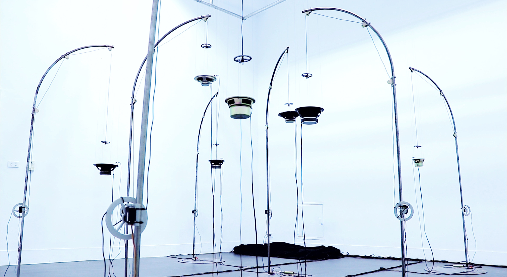

  

    Feeding is a sound installation work. There are eight units in the space. Each unit consists of a metal sculpture of a fishing rod, a condenser microphone, a speaker and a volume sensor. When the volume is too low, the string will relax so that the microphone will drop close to the speaker, and if the sound is too loud, it will rise away from the speaker to form a state of looking for balance. 
    "Wrong sound" is the main direction of my recent development of works. When a wrong sound is put into the museum, the object (speakers, microphones, etc.) get rid of the original functionality, remove the wrong division, and produces unforeseen noises. I tried to create some mechanism to make this kind of noise a spectacle. I tame this wrong sound through a mechanical device. Use the shape of the fishing rod to imply such a relationship. 
    On the other hand, this work also wants to challenge the comfort of viewing. When the microphone is approaching the speaker, it seems to be teasing the viewer's psychology, because of the sound feedback inherent danger (sound explosion, speaker failure, hearing loss, etc.) 
  

    

    

    Feeding是一件聲音裝置作品，空間中有多個單元(是空間大小而定)，每個單元皆由一個釣竿形象的金屬雕塑、一個電容式麥克風、一顆單體喇叭及一個音量感測器組成，當音量太小時釣竿上的線會放鬆使得麥克風下降接近喇叭，聲音太大會上升遠離喇叭形成一個在尋找平衡的狀態。運作過程中，因每顆喇叭會在不同頻段的聲音有較突出的表現，聲音回授將這個特性放大，使每顆喇叭有不同音高的聲響，不同單元之間也會互相影響而偶然的出現合聲，形成特殊的聽覺體驗。 
    聲音回授(audio feedback)是當我們在使用麥克風時容易發生並希望能夠避免的現象，麥克風接收的聲音訊號被放大並傳出音響，而音響傳出的聲音又再次由麥克風接收，進一步放大，然後通過音響再次傳遞出來。聲音回授作為一種錯誤的聲響，在這件作品中我將他想像成是一種失控的聲音猛獸，我試圖透過機械裝置的形式來馴服這種錯誤的聲音，利用釣竿的造型及動態暗示了這種關係。 
    「錯誤的聲音」是我最近發展作品的主要方向，當一個錯誤的聲音被放入美術館，使得物件擺脫了原本的功能性，除去了聲響中對與錯的分野，顯現聲音媒介本身的特性，同時也產生因平時被排除而無法預見的聲響，試圖創造一些機制使得這樣的噪音能夠成為某種超脫日常的存在，並且在聲音與裝置之間製造有趣的關係。 
    

    

<iframe title="vimeo-player" src="https://player.vimeo.com/video/454239749" frameborder="0" allowfullscreen></iframe>

    

    

