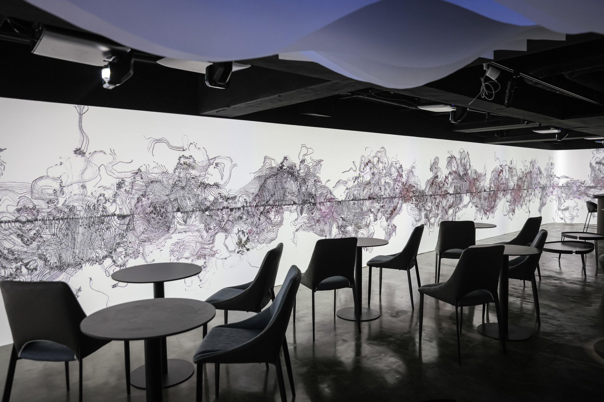

  

      

        The works start from ink, and use different algorithm to experiment with different techniques in ink and wash painting, to dynamically express lines, energy, force and rhythm, and to develop with different world-style colors and images. Sound Unlike the previous part that weakened the rhythm, it focuses more on creating a sense of Zen in pure waves. 
      

  

  

      
      
(photo credit : 潛艇Submarine)

  

  

      

        作品從水墨出發，利用演算的方法來實驗水墨畫中不同的工法像是皴法、工筆、沒骨等等，動態表現行、氣、力與頓，搭配異世界風格的配色和圖像來發展，聲音不同於以往將削弱節奏的部分，更著重在純粹的波與波之間製造禪意。 
      

  

  

      
      
(photo credit : 潛艇Submarine)

  

  

  <!-- <iframe title="vimeo-player" src="https://player.vimeo.com/video/729937826?h=0de5e9faeb" frameborder="0" allowfullscreen></iframe> -->
