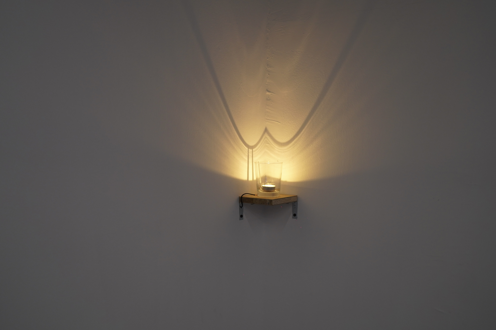

  

      

      LED lights flash continuously at a speed that is unrecognizable to our eye. There may be some messages hidden in the flickering, from the future or the past, from here or distance. The glimmer is the vibration lingering in the tranquility, carrying residue and imagination..."Listen to the Light - Routine" With the theme of daily life, I hid the recent recurring experiences in the luminous objects in the space. In order to allow viewers to explore these signals that are silently carried in the light, I made a detector which could receives the light source through the solar panel, converts the fluctuations of the light into electrical signals, and then amplifies them into sounds that can be directly felt. 
The experiences comes from working until early morning. The process of creating at night, I often deny the work I make, but they always gradually ferment when the sun rises. From the lonely late night to the early morning, the sound outside the window could usually bring me back to reality from the huge pressure at work. The lonely and tense mental state when I was creating also became loosened as the outside world began to move. The sound of wind serves as the background, the birds in the sky sing at high frequency, the iron gate is pulled up, the pace of pedestrians on the street is busy but harmonious, and the gradually increasing traffic flow is a steady bass. What I make in the living room is electronic sounds that lead to fiction spaces in the universe. There is a strong contrast between the two (morning reality sounds and sounds I made), but creating a wonderful balance in the same scene. 
In this work, all light sources would carry different sounds, no matter they are lighting tubes, TVs, candles or even seemingly ordinary extension cords. I deliberately left a lot of white space in the space, except for a few small objects, most of the space is left to light. The exhibition room seems bright and empty but filled upon sounds after the viewer puts on the detection device. through this contrast to create a sense of exploring the unknown. Wandering in different locations tinted by these lights will also receive different sounds due to approach to different light sources. 
      

  

  

      
      
(photo credit : 均勻製作 by : 房敬智)

  

  

      

        現實世界中的Led燈，以肉眼無法辨識的速度不斷地閃動。閃爍之中或許隱藏著某些訊息，來自未來或過去、來自此地或彼端，物件及痕跡中的微光是滯留於寧靜中的震動，乘載著殘留與想像......Listen to the Light - Routine 以日常為題，我將上述在近期不斷循環的經驗藏匿在展場的發光體中，為了讓觀者能夠探尋這些默默被夾帶在燈光中的訊號，我自製了一個探測器，透過太陽能板接收光源，並將光的波動轉換成電訊號，再將其放大成可直接感受到的聲音。 
這些經驗來自於工作到清晨，夜晚創作的過程中我時常否定自己做的東西，但他們卻常在太陽升起時慢慢發酵。從寂寥的深夜到人們逐漸開工的清晨，窗外的聲音往往能把我從工作中的巨量壓力拉回現實，原本創作時孤獨緊繃的心理狀態也隨著外面的世界開始運轉有些鬆脫，風聲作為背景，天上的小鳥以高頻鳴唱，鐵門拉起，街道上行人的步伐忙碌卻和諧，逐漸增加的車流像穩重的低頻聲線......。在客廳的我製作的則是通往宇宙異空間的電子聲響。兩者之間有著強烈對比，卻在同一個場景中創造了奇妙的平衡。 
在這件作品中所有的光源都將夾帶不同的聲音，不論是天花板的照明燈管、電視、蠟燭甚至是看似平平無奇的延長線，在空間上我刻意做了大量的留白，除了幾個小物件外把大部分的空間都留給光，空曠而明亮的展間，在觀者戴上探測裝置後卻充滿各式各樣的聲音，試圖透過這樣的對比來製造探索未知訊號的感覺，遊走在被這些光線渲染的不同位置也將因為接近不同的光源而接收到不同的聲響。 
      

  

  

      
      
(photo credit : 均勻製作 by : 房敬智)

  

  

      
      
(photo credit : 均勻製作 by : 房敬智)

  

  

      
      
(photo credit : 均勻製作 by : 房敬智)

  

  

      
      
(photo credit : 均勻製作 by : 房敬智)

  

  

      
      
(photo credit : 均勻製作 by : 房敬智)

  

  

      
      
(photo credit : 均勻製作 by : 房敬智)

  

  

      
      
(photo credit : 均勻製作 by : 房敬智)

  

  

  <!-- <iframe title="vimeo-player" src="https://player.vimeo.com/video/729937826?h=0de5e9faeb" frameborder="0" allowfullscreen></iframe> -->
