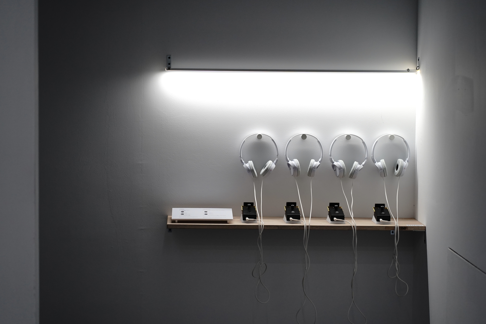

  

      

      The shimmering light in the objects and traces are the vibrations lingering in tranquility. Simultaneously carrying residuals and imaginations, and becoming objects of detection beyond the present. 
      

  

  

      
      
(photo by : 林彥翔)

  

  

      

        現實世界中的LED燈，以肉眼無法辨識的速度不斷地閃動。閃爍之中或許隱藏著某些訊息，來自未來或過去、來自此地或彼端，物件及痕跡中的微光是滯留於寧靜中的震動，乘載著殘留與想像。 為了探尋默默被夾帶在燈光中的訊號，我自製了一個探測器，透過太陽能板接收光源，並將光的波動轉換成電訊號，再將其放大成可直接感受到的聲音。 
      

  

  

      
      
(photo by : )

  

  

      
      
(photo by : )

  

  

      
      
(photo by : )

  

  

  <!-- <iframe title="vimeo-player" src="https://player.vimeo.com/video/729937826?h=0de5e9faeb" frameborder="0" allowfullscreen></iframe> -->
