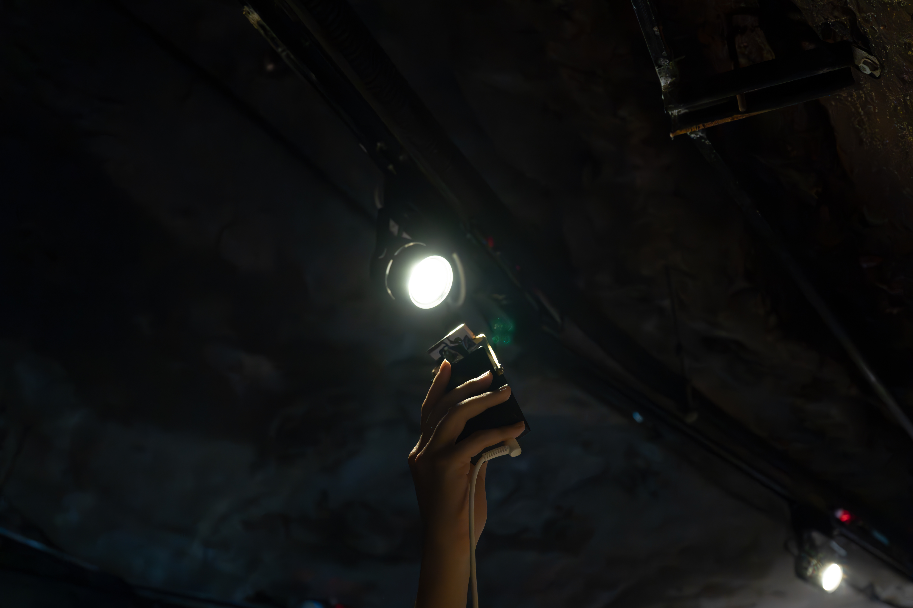
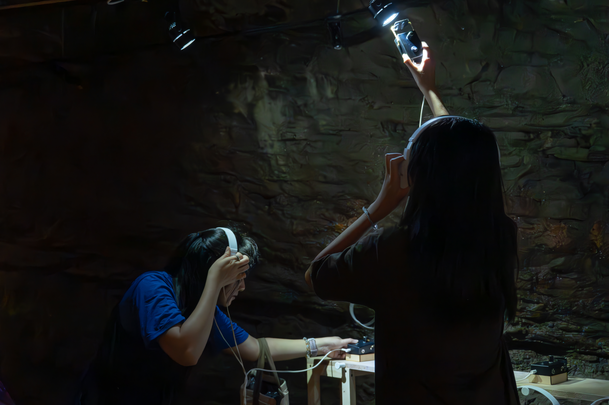

  

      

        Exhibited at the Keelung Ciao Art, the work is installed inside
an air-raid shelter built during the Japanese colonial period in Taiwan. The original lighting of the
cave was replaced with my sound-embedded lamps. The sound draws inspiration from wartime
propaganda songs of that era, which compared fighter planes to mosquitoes and dragonflies,
Through the concept, I linking vehicles and insects, and evoking the relationship between insect
sounds and electronic signals.
       
      

  

  

      

         
      

  

  

      
      
(credit : Keelung Ciao Art)

  

  

      
      
(credit : Keelung Ciao Art)

  

  

      
      
(photo by : me)

  

  

  

      
      
(photo by : me)

  

  

      
      
(photo by : me)

  

  

      
      
(photo by : me)

  

  

      
      
(photo by : me)

  

  

      
      
(photo by : me)

  

  
  

  

  <!-- <iframe title="vimeo-player" src="https://player.vimeo.com/video/936939354?h=b0dcd1ceb2" frameborder="0" allowfullscreen></iframe> -->