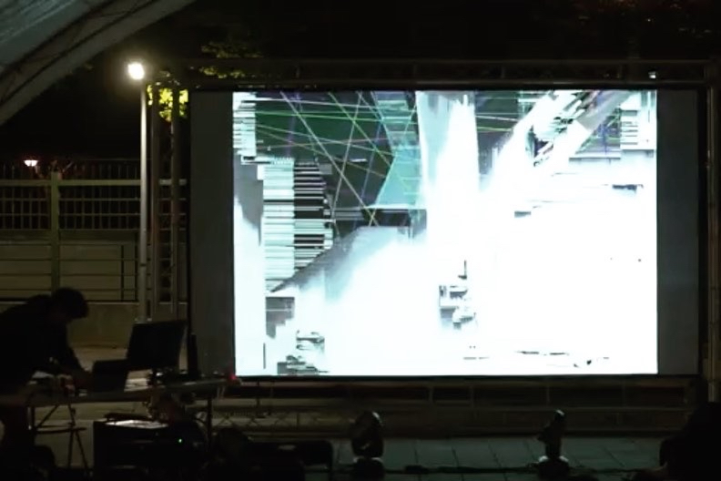

  

      

        Recently I was studying English and found that many words I don't know how to pronounced. This reminds me when I was a child, some students would add phonetic spelling to English words that they could not read, so I became a little interested in the pronunciation system. This time I used the phonetic of Chinese as the sound Develop and proceed in a unitary manner. Explain the common phenomena of Chinese pronunciation including Chinese-English comparison, "an, on" without distinction, tongue curling... At the same time I tried different operations from my previous audio visual performances, driving the behavior record by sound. 
      

  

  

      

        最近在念英文，發現有許多單字不會念，於是想到小時候有些同學會在不會念的英文單字上加上注音的拼法，因此開始對發音系統感到有點興趣，這次以中文的注音作為聲響發展，單元式的進行，闡述中文發音常有的現象包括中英對照、ㄢㄤ不分、捲舌......，同時嘗試了不同於我以往音像表演中的操作，以聲音驅動行為紀錄的影像 
      

  

  

      
      
(photo by : 葉廷皓)

  

  

      
      
(photo by : 葉廷皓)

  

 <!--  

      
  
 -->

  <!-- 

 -->

  

      
      
(photo credit : CHANG HSIN YU)

  

  

      
      
(photo credit : CHANG HSIN YU)

  

  

  <iframe title="vimeo-player" src="https://player.vimeo.com/video/548516085" frameborder="0" allowfullscreen></iframe>
