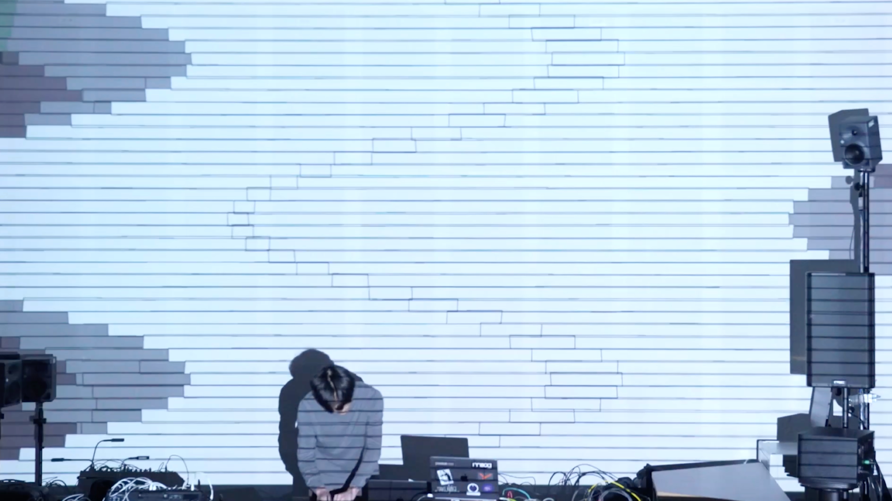
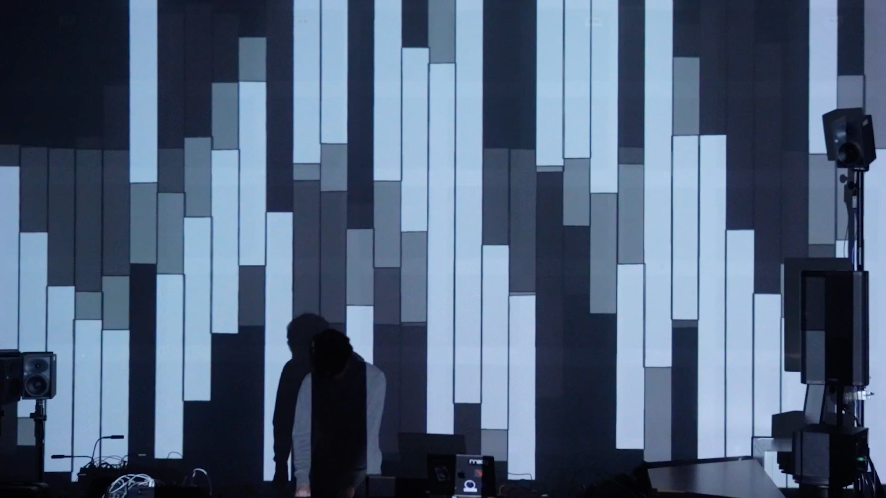

  

      

         
      

  

  

      

         
      

  

  

      
      
(photo by : 吳璨)

  

  

      
      
(photo by : 吳璨)

  

   

      
      
(photo by : 吳璨)

  

  

      
      
(photo by : 吳璨)

  

  

  <!-- <iframe title="vimeo-player" src="https://player.vimeo.com/video/1069926808?h=06fb2c96db" frameborder="0" allowfullscreen></iframe> -->
<iframe src="https://www.youtube.com/embed/xCJbfuXtEjg?si=-XlqqOHhlQPfBDmu" title="YouTube video player" frameborder="0" allow="accelerometer; autoplay; clipboard-write; encrypted-media; gyroscope; picture-in-picture; web-share" referrerpolicy="strict-origin-when-cross-origin" allowfullscreen></iframe>

  

