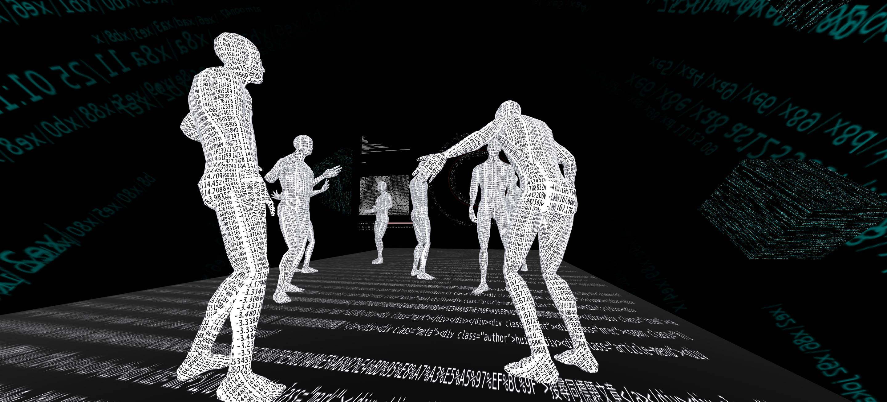
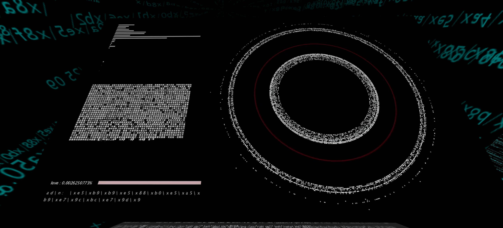
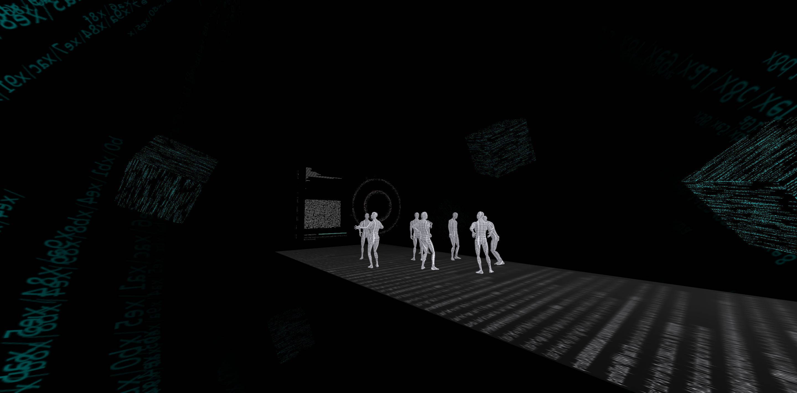

<a href="https://newart.city/show/changhsinyu" target="_blank">LINK</a>

    

      UTF-8 (8-bit Unicode Transformation Format) is now the most important character encoding format on the Internet. UTF-8 encoding is used when storing or sending text using e-mail, web pages or dating software. I used UTF-8 to encode and convert the articles and message discussions in the sex board and the love board of Internet forums PTT(well-known Internet forums in Taiwan) into binary signals. These binary signals were used as the basis for the speaker to be powered on and off, and a series of click sounds were emitted. Although the sentences are full of strong emotions, the process of encoding is like deconstructing these words and emptying their own meaning. 
    

    

    

      UTF-8(8-bit Unicode Transformation Format)是現在網路中最主要的字元編碼形式，在使用電子郵件、網頁或是交友軟體儲存或傳送文字的時候皆會經過UTF-8編碼。我利用UTF-8將知名網路論壇中西斯、男女等看板中的文章及留言討論編碼並轉換成二進位的訊號，將這些1010的訊號作為喇叭通電斷電的依據並發出一連串clip聲響。雖然語句中都是我們認知上帶有濃厚情感的詞彙，但編碼的過程就好像解構了這些文字並架空其本身具有的意義，在整個訊號被作為聲音實體化時是完全感受不到情感流通，在這樣的狀態之下，網路世界中的接收者收到訊息的同時情感又是如何被傳輸，又是如何被解碼。另外，透過此作品想呈現數位後台空間的特殊聽覺體驗，並延續我近期的創作脈絡進行一種錯誤聲響的實驗。
    

    

<!-- 

    

 -->

