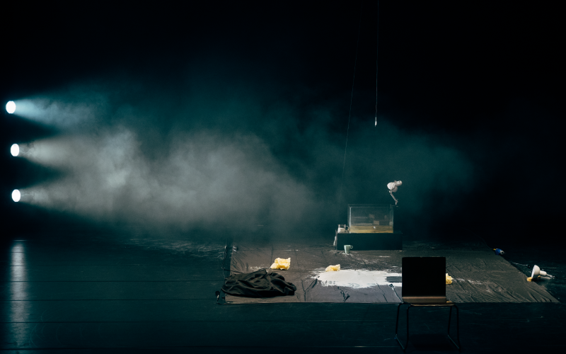
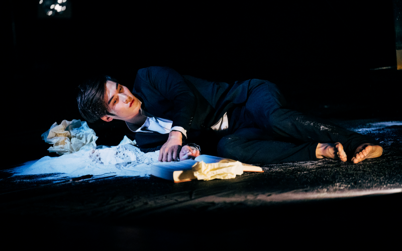

  

      

        概念發想 : 林映辰、張欣語、丹恩．賀 
燈光設計暨執行製作 : 林映辰 
聲音設計 : 張欣語 
魔術設計 : 丹恩．賀 
 
普羅米修斯教導人類沿星辰軌跡描繪時空、以語言符號勾勒靈魂的輪廓、觀察萬物生靈的預兆、解釋夢及異象並預言未來，帶來文明與意識。而後，他偷火引發宙斯大怒，遂讓潘朵拉掀開寶盒，激起人類折磨肉體與心靈的病痛、忌妒、怨恨和復仇，但唯有『希望』被封印於人類心中。 
身處資訊爆炸的當代，思考已令人難以負荷，我們偶有經歷感官扭曲與時空混置的狀態，龐雜的情感及思緒讓大腦難以消化。若能研究大腦如何造夢，嘗試拋開「知覺」並放大「視覺」、「聽覺」及「觸覺」等感官，我們是否會對周遭人事物產生不同的認知？ 
本次演出，林映辰、張欣語及丹恩．賀三位年輕創作者將透過互動式的魔術表演及聲光裝置，邀請觀眾一同進入夢境─觀察時間形變、重塑空間虛實，參與刺激感官的實驗；在自我探索、群體與空間的交互關係中，激發感官新可能。 
      

  

  

      

         
      

  

  

      
      
(photo by : )

  

  

      
      
(photo by : )

  

  

      
      
(photo by : )

  

  

      
      
(photo by : )

  

  

  

