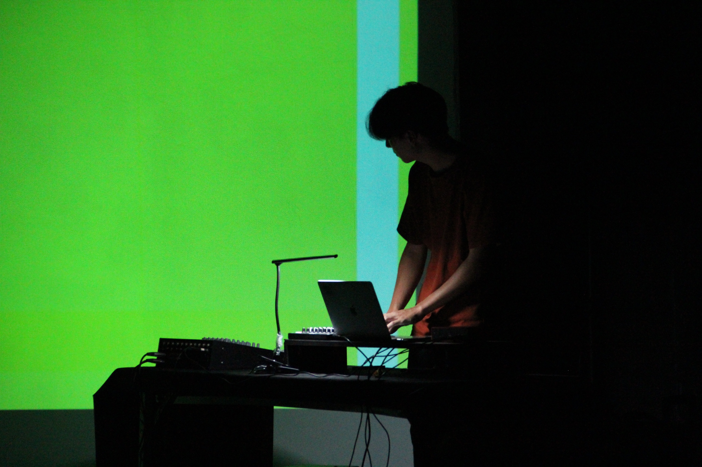
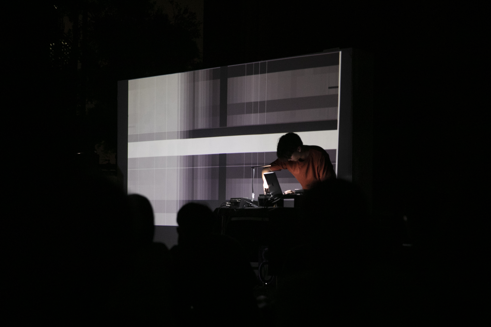

  

      

        I tried to limit the tool, only use the basic elements of sound and image to complete the entire performance. The sound part uses various modulations on sine wave to extend the possibility of a single element. The image is triggered by sound to generate blocks(light or pixels) with different motion , and a variety of random sounds and images are created from the performance by these simple rules. 
      

  

  

      

        在這場表演中，我嘗試限縮聲音及影像能使用的素材，只利用聲音及影像最基本的元素完成整場表演，聲音的部分將sine wave進行各種調變來延展單一元素的可能性，而影像則透過聲音的觸發來產生有著不同動態的方塊(光或像素)，藉由簡單的規則在表演中衍生各式隨機的聲音及畫面。 
      

  

  

      
  

  

      
  

  

  <iframe title="vimeo-player" src="https://player.vimeo.com/video/476845735" frameborder="0" allowfullscreen></iframe>
