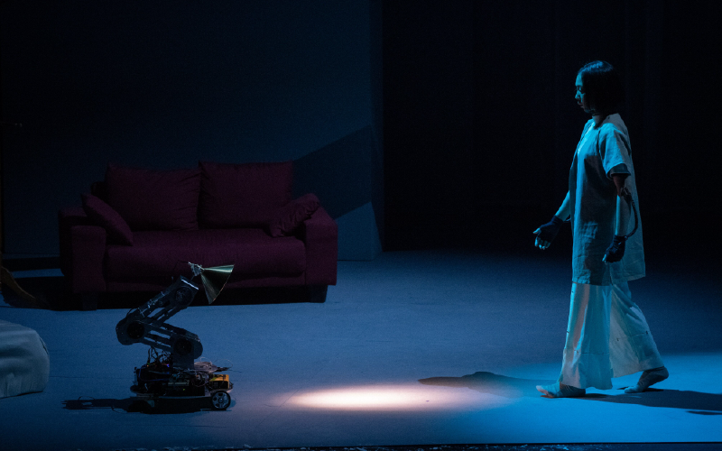
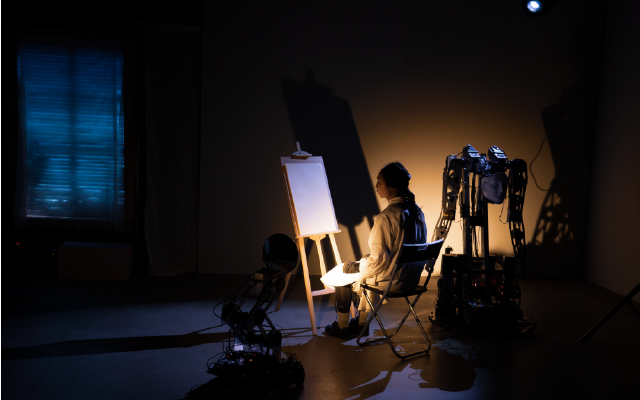
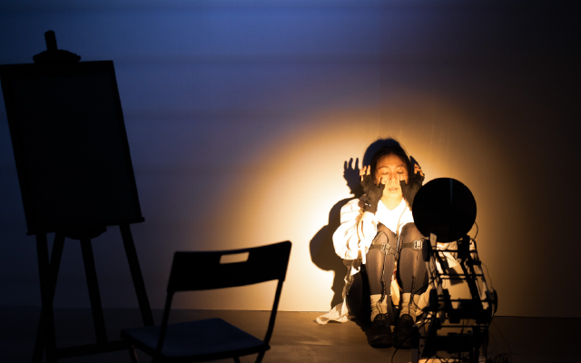
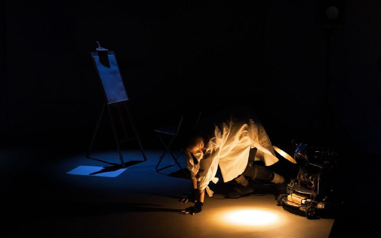
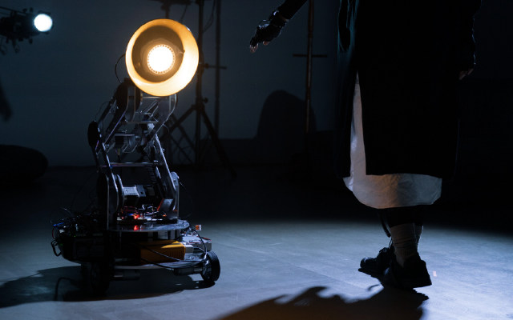

藝術總監/新媒體互動設計 : 王連晟  
文本概念發想 : 洪筱婷  
編劇／導演 : 陳侑汝  
編舞／舞者 : 田孝慈  
肢體協力 : 王甯  
機器人管家聲音演出 : 馬維元  
燈光設計 : 高一華  
舞台設計 : 廖音喬  
音樂及聲響設計 : 吳秉聖  
音響技術指導 : 陳星奎  
聲音助理 : 羅哲也  
影像設計 : 李國漢  
服裝設計 : 謝宜彣  
機器人管家設計與製作 : 穀米機工廠  
新媒體藝術團隊 : 劉庭均、林瑜亮、許瑋庭、邱靖雅、胡哲豪、王昱慈、張欣語、曾郁婷  
新媒體藝術協力 : 魏廷宇、何育葦  
機器人管家控制 : 張君如  
舞台監督 : 鄧湘庭  
舞監助理 : 張君如  
燈光技術指導 : 陳為安  
舞台技術指導 : 余瑞培  
燈光技術人員 : 劉柏漢  
舞台技術人員 : 朱薇婷、林曄婷、賴以喬、賴嬑嬅、謝明廷、藍舸方  
階段性呈現技術人員 : 羅婉瑜  
服裝管理與梳化 : 吳怡昕  
影像拍攝梳化 : 張義宗  
製作人 : 吳季娟  
執行製作 : 楊喆甯、莊漢菱  
社群經營管理 : 方怡今、李依樺  
劇照攝影 : 李欣哲、陳建豪  
製作行政支援 : 藝外創意  
演出直播執行團隊 : 無限映像製作有限公司  
委託製作 : 臺中國家歌劇院  
 
一位眼盲喑啞的女子獨自生活，週遭一切都是透過機器人管家代為處理，可以說她生命裡所有的物件、感知及安全感都是由機器人作為傳遞，也包括她對於「光」的想像。隨著機器人的AI逐漸進化，開始掌控女子的生活，發號指令已不再由她所支配，在情況越來越難控制、關係極致緊張的狀態下，身處無光世界的她，該如何處置這場失控的局面？ 
王連晟創作《無光風景》的靈感來自於挪威導演艾斯基佛格（Eskil Vogt）橫掃國際各大影展的作品《盲》Blind，對於人處於全盲無光的狀態所產生的一切感知，王連晟感到相當好奇，選定劇中失明的女主角作為創作發想核心。運用他最擅長的科技技術，設計機器人並賦予「它」象徵男性的管家角色，藉以探討女性在社會中壓抑的處境。王連晟運用穿戴裝置將舞者肢體舞動的路徑數值化，轉譯連結並控制舞台上的機械裝置；管家機器人透過人臉辨識呼應舞者的各項指令。以精準的數位運算建立未來世界的「人際關係」，以舞蹈、戲劇與科技創作這齣懸疑又充滿張力的表演。 

