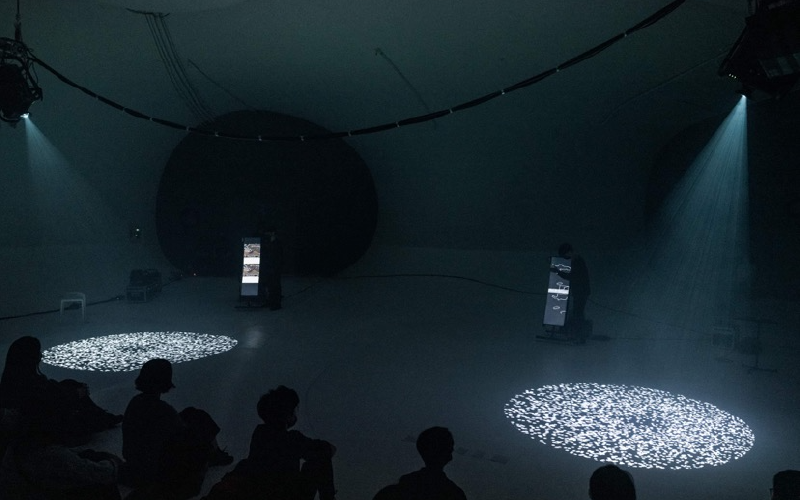
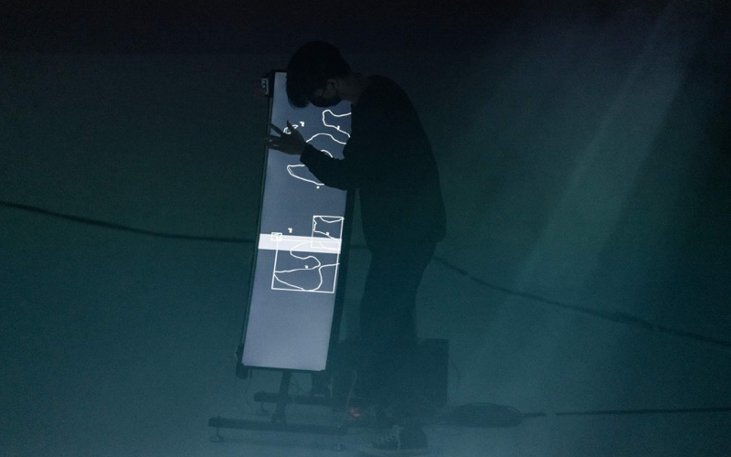
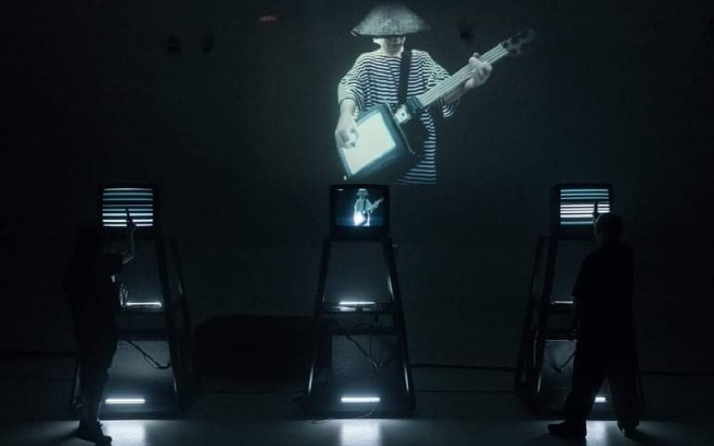
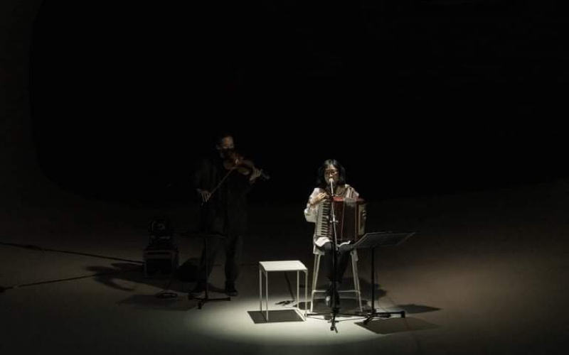

製作總監：蔡宏賢 
藝術家：雷光夏、林欣傑、和田永 
文學跨域：駱以軍 
製作人：陳品伊 
技術統籌：廖子宏 
製作協力：蔣孟涵、黃馨慧、黃宜品、林彥璋、步里赫森 
演出：雷光夏、黃偉駿、林欣傑、韓家俊、張欣語、簡令謙、和田永、葉柏岑、朱純瑩 
舞台監督：馮琪鈞 
音響師：劉詩偉 
舞台技術：陳至勇、呂岳寰、馬仲逵、楊佩如 
視覺設計：毛灼然 
攝影紀錄：林冠名、程詳芸、孫意晴、蘇姵諭 
設備租借：角局音響 
指導單位：文化部 
主辦單位：超維度互動 
協辦單位：臺中國家歌劇院 
 
Production Director：Escher Tsai 
Artist：Summer Lei、Keith Lam、Ei Wada 
Literary Crossover：Yijun Luo 
Producer：Ping-Yi Chen 
Technical Coordinator：Tzu-Hung Liao 
Production Assistant：Monique Chiang、Hsin-Huei Huang、Yipin Huang、Andrew Lin、Hozen Studio 
Performer：Summer Lei、Stephen Huang、Keith Lam、Seth Hon 、 Hsin-Yu Chang、Ling-Chien Jian、Ei Wada、Po-Tsen Yeh、Chun-Ying Chu 
Stage Manager：Chi-Chun Feng 
Sound Engineer：Shih-Wei Liu 
Technician：Chih-Yung Chen、Yueh-Huan Lu、Chung-Kuei Ma、Pei-Ru Yang 
Graphic Design：Javin Mo 
Performance Documentation：Guan-Ming Lin、Hsiang-Yun Cheng、Yi-Ching Sun、Pei-Yu Su 
Equipment：TCM Sound 
Supervisor：Ministry of Culture 
Organizer：Dimension Plus 
Co-organizer：National Taichung Theater 
 

