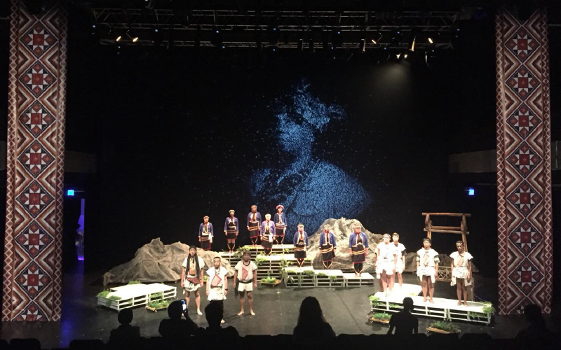
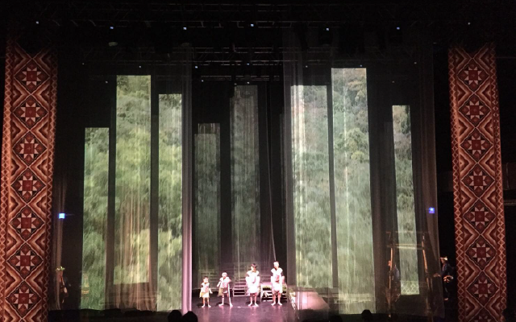

策展 : 魏心怡、袁百宏  
演出 : 南投縣魚池鄉邵族文化發展協會、邵族杵音班、國立暨南大學原住民文化產業與社會工作學士學位學程原住民族專班、楊晴儀等。  
舞臺監督 : 張舜捷  
舞監助理 : 曹書誠  
音樂設計 : 符家寶  
舞臺設計 : 鄭凱文  
舞臺技術 : 田子平  
舞蹈設計 : 黃渝棉、簡子勛  
燈光設計 : 劉志晨  
影像設計群 : 黃茵綺、張欣語、徐紹恩、王昱慈、陳恩澤、蕭合萱、王藝璇、曹書誠、陳智彥  
偶戲劇本 : 丹菁、張舜捷、魏心怡  

